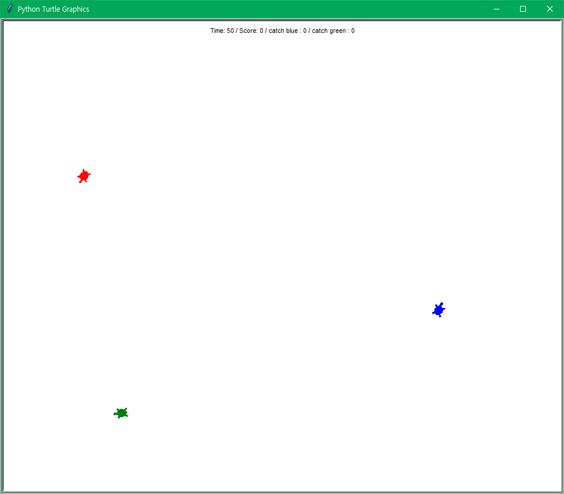

# <몬스터를 훔쳐간 녀석들>

개발자가 구현한 기능들

1. 속도가 빠른 거북이 추가
2. 시작 시 세 거북이의 위치 랜덤 지정
3. 거북이와 접촉 시 점수 부여
4. 거북이 별로 다른 점수 부여
5. 동일한 거북이를 여러번 잡을 수록 추가점수 획득
6. 도망치는 거북이는 접촉할 수록 빨라짐
7. 거북이와 접촉시 2초간 접촉 메시지 표시
8. 경계를 추가하여 밖으로 나가면 돌아옴
9. 타이머, 점수, 거북이 접촉 횟수 표시

### <조작방법>
- 이동 : 위쪽 화살표
- 회전 : 좌우 화살표(반시계/시계 방향 회전)

### <규칙>
1. 주어진 시간 60초 내에 높은 점수 기록하자.
2. 거북이와 접촉 할 때 마다 점수를 얻을 수 있다.
3. 접촉한 거북이는 점점 빨라질 것이다.

### <등장인물>
 
*플레이어*
- 초록 거북이와 파란 거북이가 냉장고에 쟁여둔 몬스터를 훔쳐갔다.
- 분노에 차오른 플레이어는 그 분을 이기지 못해 빨갛게 열이 올랐다.

*초록 거북이*
[기본점수 20점, 추가점수 2점]
- 플레이어의 몬스터를 2캔 훔쳐 먹은 나쁜녀석이다.

*파란 거북이*
[기본점수 10점, 추가점수 1점]
- 플레이어의 몬스터를 3캔이나 훔쳐 먹은 더 나쁜녀석이다.
- 많이 마셔서 그런지 파란 거북이 보다 빠르다.

### <플레이 스크린샷>
1. 게임 시작 시 랜덤한 세 위치에 거북이가 배치됨
2. 파란 거북이와 부딫힘
3. 초록 거북이와 부딫힘
4. 초록 거북이와 또 부딫힘.(추가점수 획득)
5. 최종 결과 표시